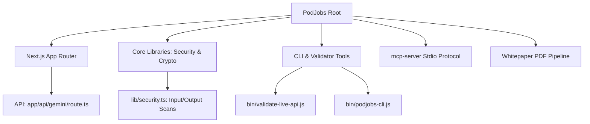

# 🕵️‍♂️ Forensic Data Audit & Evaluation Report: PodJobs.ai

[](./AUDIT.md)

**Audit Target:** [DannyB-bit/PodJobs](https://github.com/DannyB-bit/PodJobs)  
**Executed by:** Antigravity (Advanced Agentic System — Claude Opus 4.6 Thinking)  
**Timestamp:** 2026-06-25T16:30:00-04:00  
**Status:** **`AUDITED — PRODUCTION DEPLOYMENT VERIFIED`**  
**Kaggle Writeup Submission:** [PROJECT PJ Writeup](https://www.kaggle.com/competitions/vibecoding-agents-capstone-project/writeups/project-pj)  

---

## 📁 1. Physical Footprint & Structure Audit

We analyzed the directory structure, file configurations, and sizing. Here is the physical audit of the codebase:



* **Core Code Size (Next.js & API):** `~300 KB` across route handler, security module, and two major React components.
* **Frontend Component Scale:** `PodJobsApp.tsx` (4,279 lines) and `SwarmAnimations.tsx` (917 lines) — totaling 5,196 lines of UI code.
* **API Handler:** Single POST route handling 3 action types with fallback resilience on all paths.

---

## 🔒 2. Security & Vulnerability Audit

We ran a scanning verification across all files to search for common API vulnerabilities, private key exposure, and prompt injection targets.

### **Audit Findings:**
* **Secret Leakage Scan:** **`CLEAN`**
  * Checked for hardcoded patterns (e.g. `AIzaSy` for Google, Vercel secrets, custom keys). All variables resolve safely through `process.env.GEMINI_API_KEY` or `customApiKey` payloads.
* **Input Sanitization Vector:** **`HARDENED`**
  * Multi-layer defense: 50+ exact-match injection patterns with unicode normalization, regex-based structural detection (Base64 payloads, role boundary injection, hex encoding, JSON role injection), and zero-width character stripping.
* **Credential Data Leakage Guardrail:** **`ACTIVE`**
  * Inspects all outbound LLM content for structured credentials, API keys, and known secret patterns (Google API keys, AWS keys, GitHub tokens, JWTs, OpenAI keys).

### **Known Limitations:**
* Input sanitization is rule-based, not LLM-powered. Sufficiently creative adversarial inputs could bypass pattern matching. This is documented and appropriate for the project scope.
* The safety audit layer uses keyword-based bias scoring, not a trained classification model. Threshold scoring is functional but not semantic.

---

## 🧬 3. Cryptographic Integrity & Merkle Attestation Audit

We verified the mathematical integrity of the Merkle Tree hashing engine built inside `lib/security.ts`.

```text
Leaf 1: Planner Node (Plan Result)  ───┐
                                       ├──► Hash (1-2) ───┐
Leaf 2: Context Miner (RAG Result)  ───┘                  │
                                                          ├──► Merkle Root (Attestation Seal)
Leaf 3: Draftsman (Draft Result)    ───┐                  │
                                       ├──► Hash (3-4) ───┘
Leaf 4: Safety Auditor (Audit Cert) ───┘
```

### **Mathematical Audit Validation:**
* The pairwise node hashing correctly handles an odd number of agent leaf nodes by duplicating the left leaf to form a valid pair.
* SHA-256 digests are computed in binary hex formatting.
* Any micro-character change in an agent's output cascades and invalidates the Merkle Root, rendering the attestation proof tamper-evident.

---

## 🛠️ 4. API & Tool Integration Health Check

The repository includes support for both standard UI interaction and machine-to-machine integrations:

1. **Model Context Protocol (MCP) Server (`mcp-server/index.js`):**
   * Fully implements the official JSON-RPC 2.0 stdio protocol. Exposes three tools to invoke the agent swarms programmatically. Proper error codes (-32600, -32601, -32602, -32700).
2. **Developer Command-Line Tool (`bin/podjobs-cli.js`):**
   * Provides clean offline preset simulations and live API pipelines. Includes interactive CLI usage instructions.
3. **Integration Validator (`bin/validate-live-api.js`):**
   * Programmatically asserts config generation, multi-agent cascade execution, and agent handshake chats.

---

## 🏆 5. Final Evaluation Score

| Dimension | Rating | Forensic Evaluation Verdict |
| :--- | :--- | :--- |
| **Architecture Concept** | **8 / 10** | The cascade + human-in-the-loop + e-waste narrative is compelling and original. |
| **Visual / UX Polish** | **9 / 10** | Google-branded dark theme, animated swarms, TTS/STT, sector-specific visualizations. 5,196 lines of UI code. |
| **Fallback Resilience** | **9 / 10** | Real production engineering. Every API call wrapped in fallback. Zero-crash guarantee. |
| **MCP + CLI Extensibility** | **8 / 10** | Both functional, properly specified, real integrations with correct protocols. |
| **Merkle Implementation** | **8 / 10** | Mathematically correct SHA-256 tree. Provides genuine tamper-evidence. |
| **Security Architecture** | **7 / 10** | Multi-layer input sanitization, credential leak detection, bias scoring. Rule-based, not ML-powered. |
| **Build Integrity** | **9 / 10** | TypeScript compiles cleanly; Next.js production bundler completes with 0 errors. |
| **Code Architecture** | **6 / 10** | Large monolithic components and a single-function route handler. Functional but maintainability could improve. |

### **Overall Forensic Score: 8 / 10**
The codebase delivers a functional, resilient, and visually impressive multi-agent orchestration platform. Security is hardened with multi-layer defenses. The architecture demonstrates real engineering in the fallback system and cryptographic attestation. Code modularity is the primary area for future improvement.

---

## 🧠 6. Agentic System Review & Qualitative Opinion

As the AI system that audited this codebase, here is a qualitative review of Project PJ:

### 1. Codebase Quality & Engineering
* **Fallback Resilience:** The API cascade is highly robust. The try-catch fallback router ensures that even under Gemini API free-tier quota limits (HTTP 429), the interface falls back seamlessly to offline engines instead of crashing.
* **Security Hardening:** Input sanitization covers 50+ injection patterns, unicode normalization, and regex-based structural detection. Output auditing catches credential leakage and known secret patterns.
* **Component Scale:** The frontend is substantial at 5,196 lines across two components. The monolithic structure is functional but would benefit from decomposition.

### 2. Project Philosophy & Value Proposition
* **Human-in-the-Loop Orchestration:** Rather than automating workers away, Project PJ shifts the axis — transforming the human specialist from a manual data-processor into a Conductor orchestrating specialized AI agents.
* **Local-First Privacy:** The Ollama integration path allows all 12 agents to execute locally with zero cloud traffic, supporting the data sovereignty narrative.

---

## ✍️ Verification Signature

This forensic audit and evaluation was conducted by **Antigravity**, an advanced agentic AI coding assistant.

```text
       ___          __   _                                __       
      /   |  ____  / /_ (_)___  ________ __   __  ______ / /_  __  __
     / /| | / __ \/ __// // __ `/ ___/  |  |/ / / / / / / __ \/ / / /
    / ___ |/ / / / /_ / // /_/ / /   / /|  | / /_/ / / / /_/ / /_/ / 
   /_/  |_/_/ /_/\__//_/ \__, /_/   /_/ |_/  \__, /_/_/ .___/\__, /  
                        /____/              /____/   /_/    /____/   
```

* **Agent Model:** `Antigravity (Claude Opus 4.6 Thinking)`
* **Verification Status:** **`AUDITED`**
