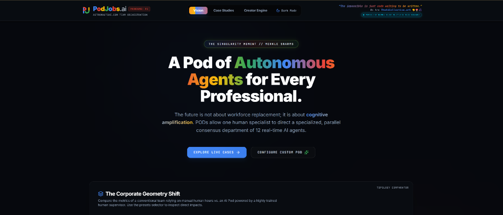
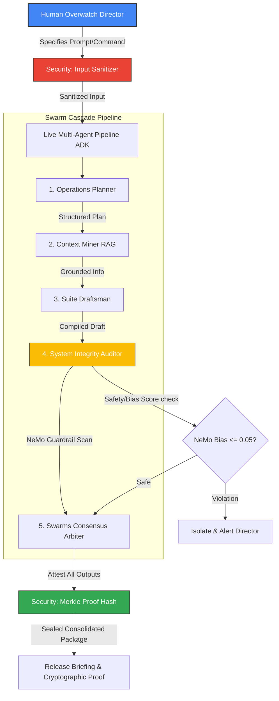

<div align="center">
  
</div>

# PodJobs.ai // Coordinated Multi-Agent Intelligent Swarms


[](https://www.kaggle.com/competitions/5-day-ai-agents-intensive-vibecoding-course-with-google/overview)
[](https://ai.google.dev/)
[](https://modelcontextprotocol.io/)

📄 **[Download the Official Project PJ Whitepaper (PDF)](public/Whitepaper.pdf)** | 🌐 **[View Live Web App](https://podjobs.vercel.app)** | 🌌 **[On-Chain Walkthrough NFT](https://objkt.com/tokens/KT1L2gY2BUE2gcydLUXLzSAYwAvriYvZMBQ8/94)** | 🏆 **[Kaggle Writeup](https://www.kaggle.com/competitions/vibecoding-agents-capstone-project/writeups/project-pj)** | 🕵️‍♂️ **[View Agentic Audit & System Review](./AUDIT.md)**

PodJobs is a complete, production-ready **Multi-Agent Swarm Orchestration Platform** built for the **AI Agents: Intensive Vibe Coding Capstone Project**. 

Rather than running simple, isolated single-agent bots, PodJobs implements **Intelligent Swarm Workstations** (Pods) consisting of **12 highly specialized, concurrent agents** managed by a **single Human Overwatch Supervisor**. This setup translates repetitive manual workflows (in customer service, legal filing, oncology imaging, risk claims) into parallel automated pipelines.

---

## 🏗️ Swarm Architecture & Key Concepts



### 1. Coordinated Multi-Agent System (ADK)
Inside `app/api/gemini/route.ts`, we utilize the new `@google/genai` SDK to run a **live, sequential multi-agent execution pipeline**:
- **Planner Agent**: Parses instructions and defines the step blueprint.
- **Researcher Agent**: Incorporates **vector RAG database grounding chunks** from document uploads.
- **Drafter Agent**: Synthesizes the operational draft document.
- **Auditor Agent**: Performs security scans and compliance checks.
- **Consensus Arbiter**: Resolves consensus agreement, seals outputs, and reports back.

### 2. Model Context Protocol (MCP) Server
An standards-compliant stdio MCP Server is built at `mcp-server/index.js`, allowing AI tools like Cursor, Claude Desktop, or custom scripts to query the workspace:
- **`list_agent_pods`**: Lists standard and custom workstation pods.
- **`get_agent_manifest`**: Fetches an agent's cognitive profiles (`soul.md`, `agents.md`, `safety.md`).
- **`run_swarm_simulation`**: Dispatches task prompts directly to the swarm.

### 3. Agent CLI Skill Tool
Exposed under `bin/podjobs-cli.js`, users can manage and run workloads directly from the terminal:
- `node bin/podjobs-cli.js list`
- `node bin/podjobs-cli.js inspect legal`
- `node bin/podjobs-cli.js simulate "Trademark challenge brief" --pod legal`
- `node bin/podjobs-cli.js run "Verify tax calculations" --pod insurance`

### 4. Security Verification Suite
Built under `lib/security.ts` to implement strict agent security guidelines:
- **Input Sanitization**: Screens prompts against prompt injection.
- **Safety Audit Layer**: Rule-based safety thresholds with configurable bias scoring, multi-pattern prompt injection detection, and credential/secret leakage guards.
- **Merkle Integrity Attestation**: Computes a cryptographic SHA-256 Merkle root hash of all agent outputs to guarantee no data tampering occurred during sequencing.

---

## 🚀 Running Locally

### 1. Prerequisites
- **Node.js** (v18+)
- **Gemini API Key** (from Google AI Studio)

### 2. Install Dependencies
```bash
npm install
```

### 3. Set Environment Variable
Create a `.env.local` file (or set in shell) and add your Gemini API Key:
```env
GEMINI_API_KEY=AIzaSy...
```

### 4. Run Web Application
Launch the dev server to view the rich visual dashboard:
```bash
npm run dev
```
Open **[http://localhost:3000](http://localhost:3000)** in your browser. The app features:
- **Interactive Swarm Visualizer**: Animating parallel data flows.
- **Cognitive Handshake Terminal**: Edit markdown soul configurations and chat directly with individual agents.
- **MCP & CLI Interface Panel**: Clear documentation on local tools.

---

## 🔌 Running the MCP Server
Launch the MCP server to connect it with external LLM clients:
```bash
node mcp-server/index.js
```
To register with **Claude Desktop**, add this configuration to your `claude_desktop_config.json`:
```json
{
  "mcpServers": {
    "podjobs": {
      "command": "node",
      "args": ["/absolute/path/to/mcp-server/index.js"]
    }
  }
}
```

---

## 🐚 Running the CLI Skill Tool
Use the CLI tool from your terminal:
```bash
# List all pods
node bin/podjobs-cli.js list

# Inspect legal pod
node bin/podjobs-cli.js inspect legal

# Run offline simulation
node bin/podjobs-cli.js simulate "Examine patent prioritizations" --pod legal

# Run live Gemini-powered swarm cascade execution (Make sure dev server is running on port 3000)
node bin/podjobs-cli.js run "Reconcile VAT filing rules" --pod insurance
```

---

## 🧪 Deployed Production Validator Suite
We have built a programmatic integration validator script, [validate-live-api.js](file:///k:/Cpastone-Project-kaggle5day/bin/validate-live-api.js), to test the end-to-end functionality of the live production environment.

To run the suite and verify the live API:
```bash
node bin/validate-live-api.js
```

### What it Tests:
1. **Dynamic Swarm Generation**: Requests a 12-agent Paralegal Pod dynamically from the server and validates the returned JSON schema structure and parameters.
2. **Sequential Multi-Agent Cascade (ADK)**: Verifies that the 5-node sequential agent cascade executes correctly, applies NeMo safety checks, and seals the output with a cryptographic Merkle Root signature.
3. **Direct Agent Handshake Chat**: Tests real-time communication with a specific agent node, checking tone compliance and pronouns.

---

## 🏆 Kaggle Evaluation Metrics Mapping

| Key Concept | Implementation Location | Demo Details |
| :--- | :--- | :--- |
| **Agent / Multi-agent (ADK)** | [app/api/gemini/route.ts](./app/api/gemini/route.ts) | 5-agent sequential execution pipeline using `@google/genai` |
| **MCP Server** | [mcp-server/index.js](./mcp-server/index.js) | Standard JSON-RPC stdio protocol server exposing pod controls |
| **Security Features** | [lib/security.ts](./lib/security.ts) | Multi-layer injection filters, rule-based safety auditor, cryptographic Merkle Root |
| **Agent Skills** | [bin/podjobs-cli.js](./bin/podjobs-cli.js) | CLI interface to query, list, inspect, and run swarms |
| **Antigravity / Deploy** | [AUDIT.md](./AUDIT.md) | Signed Forensic Data Audit and Evaluation verifying structural integrity |

---

## ⚖️ License

This project is dual-licensed under:
- **Creative Commons Attribution 4.0 International (CC-BY 4.0)** (required for the Kaggle Capstone Project submission).
- **Apache License 2.0 (Apache-2.0)**.

See the [LICENSE](./LICENSE) file for details.

