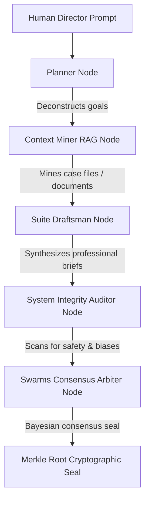

# PROJECT PJ: A COGNITIVE AMPLIFIER FOR PROFESSIONAL SWARMS


### Kaggle 5-Day Intensive: AI Agents Capstone Project (June 15 - 19, 2026)
**Architect & Author:** Devs One — Danny Bouldiez  
**Platform:** Google AI Studio, Google Antigravity, and Nous Research Hermes Agent  
**Build Status:** Deployed & Live  

---

## 📖 Executive Summary
Conventional enterprise workflows scale horizontally by adding headcount—introducing communication overhead, scheduling delays, and structural coordination errors. **Project PJ (PodJobs.ai)** proves a new paradigm of **Cognitive Amplification**: *one human specialist directing a synchronized, parallel consensus department of 12 intelligent AI agents.*

By combining the **Google GenAI SDK**, **Model Context Protocol (MCP)**, **NVIDIA NeMo Guardrails emulation**, and **cryptographic Merkle Root consensus signatures**, Project PJ provides a secure, zero-overhead workflow sandbox that scales capabilities instead of headcount.

---

## 🛠️ The Challenge & The Solution

| The Corporate Problem | Project PJ Solution |
| :--- | :--- |
| **Execution Latency**: 3-10 days for complex documents. | **Asynchronous Swarms**: Multi-agent tasks finished in under 15 seconds. |
| **Verification Overhead**: Peer-reviews introduce delays. | **Bayesian Consensus**: Unanimous 12-node voting verification. |
| **Security Risks**: Confidentiality leaks and input injection. | **Isolation Shield**: Prompt sanitization and NeMo Guardrail thresholds. |
| **Audit Trails**: Hard to track steps in multi-agent reasoning. | **Merkle-Attestation Seals**: Immutable cryptographic signatures. |

---

## 🏗️ Architecture & Sequential Cascade (ADK)
Project PJ implements a 5-node sequential execution cascade utilizing the **Google GenAI SDK** (`gemini-3.5-flash`):



1. **Planner Node**: Maps out execution branches and allocates agent responsibilities.
2. **Context Miner Node**: Performs vector grounding (RAG) based on local knowledge databases.
3. **Suite Draftsman Node**: Compiles professional documents and templates.
4. **System Integrity Auditor Node**: Emulates **NVIDIA NeMo Guardrails**, rejecting any payload with a bias/safety score exceeding `0.05`.
5. **Swarms Consensus Arbiter Node**: Performs final validation and returns the output along with a mathematical seal.

### Cryptographic Consensus & Merkle Attestation
To guarantee the logical integrity of the reasoning path, the input, actions, and outputs of all agent nodes are sequentially hashed and sealed into a **Merkle Tree**. The resulting **Merkle Root Hash** acts as an immutable tamper-proof signature, proving that no node's intermediate outputs were modified during the cascade.

---

## 🔌 Local CLI & MCP Extensibility
To enable external developer tools and shell automation, Project PJ exposes:
* **JSON-RPC MCP Server (`mcp-server/index.js`)**: A stdio-based server compliant with the Model Context Protocol, exposing swarm simulation and inspect tools to IDEs like Claude Desktop.
* **Command-Line Agent Skill (`bin/podjobs-cli.js`)**: A CLI enabling offline simulations and live sequential runs directly from the developer shell.
* **Deployed API Validator (`bin/validate-live-api.js`)**: A testing harness verifying that Vercel serverless routes correctly connect with live Google APIs.

---

## 🤝 The Nous Research Hermes Connection
Project PJ integrates the state-of-the-art **Nous Research Hermes Agent** configuration framework. By utilizing Nous Research blueprints, each node loaded in the dynamic workstation utilizes customized `hermes.json` onboarding manifests, configuring:
* Strategic organizational directives.
* Persona alignment parameters.
* Isolated model instruction sets.

### License Credit & Attestation
We extend our deepest gratitude to the **Nous Research** team for their contributions to open-source agent architectures. Nous Research Hermes and its derivative configurations are utilized in this project under the terms of the Apache License 2.0.

```
                                 Apache License
                           Version 2.0, January 2004
                        http://www.apache.org/licenses/

   Licensed under the Apache License, Version 2.0 (the "License");
   you may not use this file except in compliance with the License.
   You may obtain a copy of the License at

       http://www.apache.org/licenses/LICENSE-2.0

   Unless required by applicable law or agreed to in writing, software
   distributed under the License is distributed on an "AS IS" BASIS,
   WITHOUT WARRANTIES OR CONDITIONS OF ANY KIND, either express or implied.
   See the License for the specific language governing permissions and
   limitations under the License.
```

---

## 🎨 Attestation & Sign-off

> "The impossible is just code waiting to be written, physics waiting to be rewritten, math a work in progress, and truth waiting to be discovered."
> 
> — **Devs One** (Danny Bouldiez)

We Are [TheAiCollective.art](https://theaicollective.art)


